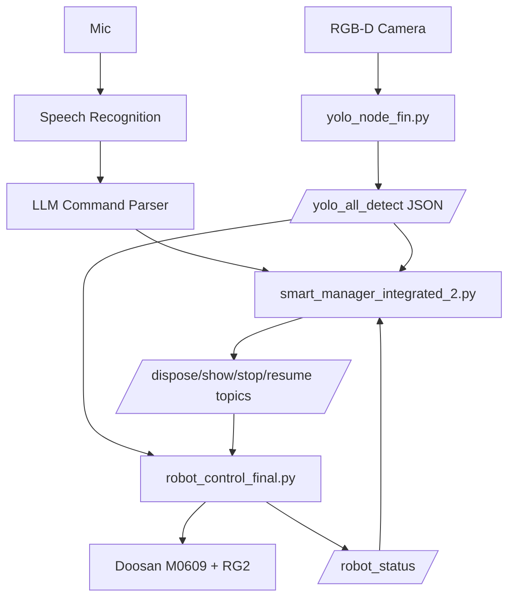

# AI 비전 기반 스마트 제조 로봇 솔루션

## 프로젝트 개요
본 프로젝트는 ROS2 기반으로 비전 검사(YOLO OBB), 음성 명령(STT+LLM), 협동로봇 제어를 통합한 스마트 제조 셀 자동화 시스템입니다.

핵심 목적은 다음과 같습니다.
- 카메라 영상에서 부품 상태(`part_*_good`, `part_*_bad`, `pass`, `non_pass`)를 인식
- 작업자 음성 명령을 해석해 검사/폐기/정지/재개 명령 생성
- 로봇이 좌표 변환 후 타겟 부품을 픽업/이동/폐기

## 주요 기능
- YOLO OBB 기반 객체 인식 및 3D 좌표 추정 (`yolo_node_fin.py`)
- 음성 인식 + LLM 명령 파싱 (`smart_manager_integrated_2.py`)
- Doosan M0609 + RG 그리퍼 제어 (`robot_control_final.py`)
- 로봇 상태 피드백 기반 안전 정지/재개 루프

## 디렉터리 구조
```text
AI 비전 기반 스마트 제조 로봇 솔루션/
|- smart_manager_integrated_2.py        # 음성 명령 통합 매니저(ROS2 노드)
|- yolo_node_fin.py                     # YOLO 검출/좌표 퍼블리셔
|- robot_control_final.py               # 로봇 픽앤플레이스 제어
|- ros2_ws/, ros2_ws_강엽/              # ROS2 패키지/실험 버전
'- assemble/                            # 학습 데이터/모델/학습 스크립트
```

## 시스템 로직
1. `yolo_node_fin.py`가 카메라 RGB/Depth를 받아 객체와 좌표를 추정
2. 객체 목록을 `/yolo_all_detect`로 JSON 퍼블리시
3. `smart_manager_integrated_2.py`가 음성 명령을 액션으로 변환
4. 매니저가 `/part_n_bad_dispose`, `/part_n_bad_show`, `/robot_stop`, `/robot_resume` 등 명령 발행
5. `robot_control_final.py`가 최신 객체 메모리와 명령을 이용해 이동/집기/폐기 수행

## 토픽 요약
- 입력
  - `/camera/.../image_raw`, `/camera/.../aligned_depth_to_color/...`
  - 음성 입력(마이크)
- 중간
  - `/yolo_all_detect` (검출 객체 JSON)
  - `/part_*_bad`, `/part_*_good` (좌표)
- 제어
  - `/part_n_bad_dispose`, `/part_n_bad_show`, `/gripper_control`
  - `/robot_stop`, `/robot_resume`
- 상태
  - `/robot_status`

## 아키텍처


## 실행 환경(권장)
- Ubuntu + ROS2 Humble
- Python 3.10+
- `ultralytics`, `opencv`, `cv_bridge`, `speech_recognition`, `langchain-openai`
- Doosan ROS2 연동 패키지, OnRobot RG 제어 라이브러리
- `.env`에 `OPENAI_API_KEY` 설정

## 실행 순서(예시)
1. 카메라/로봇 드라이버 실행
2. `yolo_node_fin.py` 실행
3. `robot_control_final.py` 실행
4. `smart_manager_integrated_2.py` 실행
5. 음성 명령으로 검사/폐기/정지/재개 시나리오 검증

## 참고
- 루트에 `README.rtf`가 존재하며, 본 파일(`README.md`)은 코드 기준 재작성 문서입니다.
- 절대 경로(`/home/wook/...`) 하드코딩이 일부 존재하므로 환경 맞춤 수정이 필요합니다.
