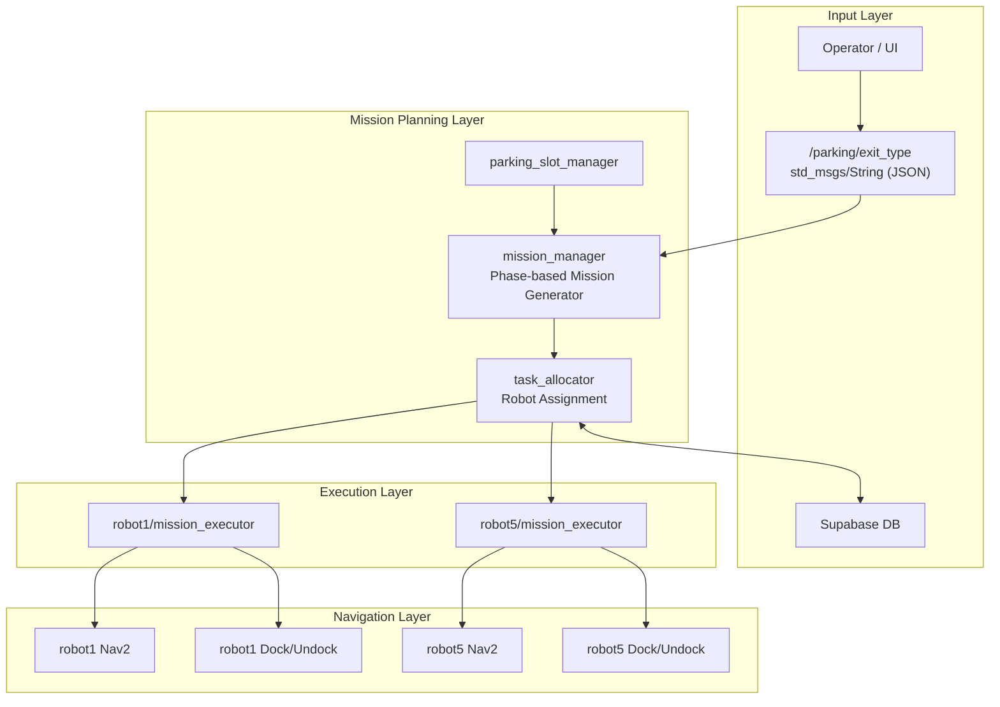

# ROKEY_Projects
Doosan robotics bootcamp projects

## 📡 System Architecture (Multi-AMR Parking Valet Automation)

📘 Multi-AMR Parking Valet Automation System
(ROS2-based Multi-Robot Mission Orchestration Architecture)
1️⃣ 시스템 개요

본 프로젝트는 다중 AMR(TurtleBot4) 기반 주차대행(출차) 자동화 시스템이다.

출차 요청을 입력받으면 시스템은 다음의 계층 구조를 따라 동작한다:

출차 요청 수신

슬롯 상태 분석 및 미션 시퀀스 생성

로봇별 미션 분배

Nav2 기반 자율 이동 및 도킹/언도킹 수행

상태 업데이트 및 DB 반영

2️⃣ 전체 시스템 아키텍처

(README에 포함할 Mermaid – 세로형 문서용)

3️⃣ 패키지 구조 및 역할
📦 parking_msgs (Interface Definition Layer)

시스템 내부 통신 표준 정의 패키지.

주요 메시지
Message	설명
Mission	단일 로봇 행동 단위 (목표 좌표, Phase 등)
MissionArray	여러 Mission을 포함한 시퀀스
MissionStatus	현재 미션 실행 상태
SlotStates	주차 슬롯 점유 상태

👉 장점: 모듈 간 강결합 방지 / 확장성 확보

📦 parking_system (Orchestration Layer)

시스템의 핵심 제어 레이어.

1. parking_slot_manager

슬롯 점유 상태 관리

slot_states topic publish

2. mission_manager

출차 요청을 받아 Phase 기반 미션 시퀀스 생성

입력:

/parking/exit_type (JSON)

slot_states

(선택) 차량 타입 정보

출력:

raw_missions (MissionArray)

미션 예시 흐름:

Phase 1: robot1 → 차량 위치 이동
Phase 2: robot5 → 보조 이동
Phase 3: robot1 → 출구 위치 이동
Phase 4: robot5 → 복귀

3. task_allocator

raw_missions를 robot1 / robot5로 분배

각 로봇 namespace로 assigned_missions publish

Supabase DB 상태 갱신

📦 parking_executor (Execution Layer)

각 로봇마다 하나의 mission_executor 노드 실행.

mission_executor 주요 기능

assigned_missions 수신

Mission Queue 구성

Nav2 Action Client로 목표 좌표 이동

Dock/Undock action 수행

MissionStatus publish

📦 rokey_pjt (Optional Perception Layer)
차량 타입 분류 (YOLO 기반)

/vehicle_label publish

슬롯 배치 로직에 활용 가능

Line Alignment

카메라 기반 미세 정렬

Nav2 waypoint 도착 후 정밀 위치 보정

4️⃣ 데이터 흐름
주요 토픽 인터페이스
Topic	Type	Publisher	Subscriber	목적
/parking/exit_type	String(JSON)	UI	mission_manager	출차 요청
slot_states	SlotStates	slot_manager	mission_manager	슬롯 상태
raw_missions	MissionArray	mission_manager	task_allocator	전체 미션
robotX/assigned_missions	MissionArray	task_allocator	mission_executor	로봇별 미션
mission_status	MissionStatus	mission_executor	system	실행 상태
5️⃣ 실행 시퀀스 (Single Exit 예시)

1️⃣ 운영자 출차 요청
2️⃣ mission_manager가 슬롯 상태 확인
3️⃣ 출차 유형 분석 (SINGLE / DOUBLE)
4️⃣ Phase 기반 MissionArray 생성
5️⃣ task_allocator가 robot1 / robot5 분배
6️⃣ 각 mission_executor가 Nav2 Action 호출
7️⃣ Dock/Undock 수행
8️⃣ DB 상태 갱신

6️⃣ 시스템 설계 특징
1. 계층 분리 설계

Planning / Allocation / Execution 분리

Navigation은 Nav2에 위임

확장성 및 유지보수 용이

2. Multi-Robot Namespace 구조

robot1, robot5 독립 실행

동일 executor 코드 재사용

3. Action 기반 이동 제어

NavigateToPose Action Client 사용

동기적 상태 확인 가능

4. 외부 DB 연동

상태 저장소 분리

다중 세션 관리 가능

7️⃣ 확장 가능 구조

로봇 추가 시:

mission_executor 인스턴스 추가

allocator 로직 확장

SLAM 기반 동적 슬롯 매핑 가능

차량 인식 기반 자동 슬롯 배정 가능