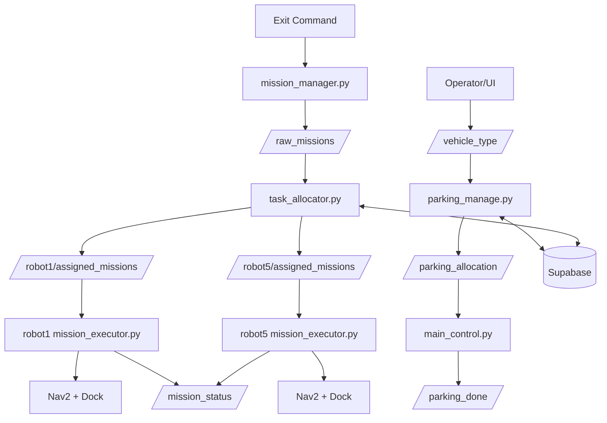

# 다중 AMR 주차대행 자동화 시스템 제어

## 프로젝트 개요
본 프로젝트는 ROS2 기반 다중 AMR(주로 TurtleBot4) 주차대행 자동화 시스템입니다.
입차(주차 슬롯 할당 + 자율주행 정렬)와 출차(미션 생성/분배/실행)를 분리해 설계했습니다.

## 핵심 구성
- 입차
  - `parking_manage.py`: Supabase 기반 주차 슬롯 관리/할당
  - `main_control.py`: Nav2 주행 + 라인 정렬 + 주차 완료 신호
- 출차(이중/단일 시나리오)
  - `mission_manager.py`: 출차 요청을 phase 기반 미션으로 변환
  - `task_allocator.py`: robot1/robot5 미션 분배
  - `mission_executor.py`: Nav2/Dock/Undock/정렬 실행
  - `parking_msgs`: 커스텀 메시지 인터페이스

## 디렉터리 구조
```text
다중 AMR 주차대행 자동화 시스템 제어/
|- 본프로젝트/
|  |- 입차/코드/
|  |  |- parking_manage.py
|  |  '- main_control.py
|  '- 출차/코드/이중단일주차/src/
|     |- parking_msgs/
|     |- parking_system/   # mission_manager, task_allocator
|     '- parking_executor/ # mission_executor
|- 미니프로젝트/
'- 문서/ (BRD/SRD/SDD/아키텍처 문서)
```

## 시스템 로직
### 입차
1. 차량 타입 입력(`/vehicle_type`)
2. `parking_manage.py`가 DB 기반 가용 슬롯 탐색/할당
3. `/parking_allocation`으로 목표 좌표 발행
4. `main_control.py`가 Nav2 이동 후 비전 정렬
5. `/parking_done` 발행 및 상태 갱신

### 출차
1. 출차 요청 수신
2. `mission_manager.py`가 SINGLE/DOUBLE 시나리오별 MissionArray 생성
3. `task_allocator.py`가 robot1/robot5에 미션 배포
4. 각 `mission_executor.py`가 Nav2 + 도킹 + 라인정렬 실행
5. `MissionStatus`로 진행 상태 피드백

## 아키텍처


## 주요 토픽/인터페이스
- `std_msgs/String`: `/vehicle_type`, `/parking_allocation`, 출차 명령
- `parking_msgs/MissionArray`: `raw_missions`, `robotX/assigned_missions`
- `parking_msgs/MissionStatus`: `robotX/mission_status`
- `std_msgs/Bool`: `/parking_done`

## 실행 환경(권장)
- Ubuntu + ROS2 Humble
- TurtleBot4 + Nav2
- Python: `supabase`, `opencv`, `cv_bridge`
- DB: Supabase `parking_locations`, `tasks` 테이블

## 실행 순서(권장)
1. Nav2/로봇 bringup
2. 입차 스택(`parking_manage.py`, `main_control.py`) 실행
3. 출차 스택(`mission_manager.py`, `task_allocator.py`, `mission_executor.py`) 실행
4. UI 또는 task command로 입/출차 시나리오 검증

## 참고
- 문서 폴더에 BRD/SRD/SDD 및 시스템 다이어그램 PDF가 함께 포함되어 있습니다.
- 현재 코드에는 실험/백업 파일이 다수 포함되어 있어, 운영 시 엔트리 파일 고정이 필요합니다.
