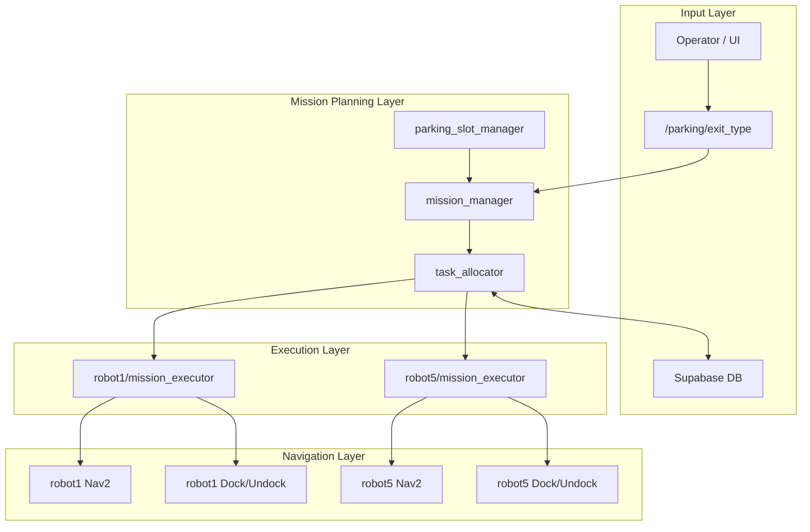

# 🚗 Multi-AMR Parking Valet Automation System  
### ROS2-based Multi-Robot Mission Orchestration Architecture

---

## 📌 System Overview

본 프로젝트는 다중 AMR(TurtleBot4)을 활용한 주차대행(출차) 자동화 시스템이다.

출차 요청이 들어오면 시스템은 다음의 계층 구조를 따라 동작한다:

1. 출차 요청 수신  
2. 슬롯 상태 분석  
3. Phase 기반 미션 시퀀스 생성  
4. 로봇별 미션 분배  
5. Nav2 기반 자율 이동 및 Dock/Undock 수행  
6. 상태 업데이트 및 DB 반영  

---

## 📡 System Architecture

---

## 📦 Package Structure

### 1️⃣ parking_msgs (Interface Layer)

시스템 내부 통신을 위한 메시지 정의 패키지.

주요 메시지:

- `Mission` : 단일 로봇 행동 단위  
- `MissionArray` : 여러 Mission을 포함한 시퀀스  
- `MissionStatus` : 현재 미션 실행 상태  
- `SlotStates` : 주차 슬롯 점유 상태  

모듈 간 강결합을 방지하고 확장성을 확보하기 위한 인터페이스 계층이다.

---

### 2️⃣ parking_system (Orchestration Layer)

시스템의 핵심 제어 로직을 담당한다.

#### parking_slot_manager

- 슬롯 상태를 관리
- `slot_states` topic publish

#### mission_manager

- `/parking/exit_type` 입력을 받아 Phase 기반 미션 생성
- SINGLE / DOUBLE 출차 시나리오 처리
- `raw_missions (MissionArray)` publish

#### task_allocator

- `raw_missions`를 robot1 / robot5로 분배
- 각 로봇 namespace로 `assigned_missions` publish
- Supabase DB 상태 업데이트

---

### 3️⃣ parking_executor (Execution Layer)

각 로봇에 대해 mission_executor 노드를 실행한다.

주요 기능:

1. assigned_missions 수신  
2. Mission Queue 구성  
3. Nav2 NavigateToPose Action 호출  
4. Dock / Undock 수행  
5. MissionStatus publish  

---

### 4️⃣ rokey_pjt (Optional Perception Layer)

차량 인식 및 정밀 정렬 기능을 담당한다.

- YOLO 기반 차량 타입 분류  
- 카메라 기반 Line Alignment  
- waypoint 도착 후 정밀 위치 보정  

---

## 🔄 Data Flow

| Topic | Type | Publisher | Subscriber | Purpose |
|-------|------|----------|-----------|---------|
| `/parking/exit_type` | String | UI | mission_manager | 출차 요청 |
| `slot_states` | SlotStates | slot_manager | mission_manager | 슬롯 상태 |
| `raw_missions` | MissionArray | mission_manager | task_allocator | 전체 미션 |
| `robotX/assigned_missions` | MissionArray | task_allocator | mission_executor | 로봇별 미션 |
| `mission_status` | MissionStatus | mission_executor | system | 실행 상태 |

---

## 🚀 Execution Flow (Single Exit Example)

1. 운영자가 출차 요청 전송  
2. mission_manager가 슬롯 상태 확인  
3. 출차 유형 분석  
4. Phase 기반 MissionArray 생성  
5. task_allocator가 로봇별 분배  
6. mission_executor가 Nav2 Action 호출  
7. Dock/Undock 수행  
8. DB 상태 갱신  

---

## 🧠 Design Characteristics

- Mission / Allocation / Execution 계층 분리 설계  
- Nav2 Action 기반 이동 제어  
- Multi-namespace 구조 (robot1, robot5)  
- 외부 DB 연동을 통한 상태 관리  
- 확장 가능한 다중 로봇 구조  

---

## 📖 Architectural Summary

A layered multi-robot orchestration architecture separating mission planning, allocation, and execution using ROS2 messaging and Nav2 actions.
