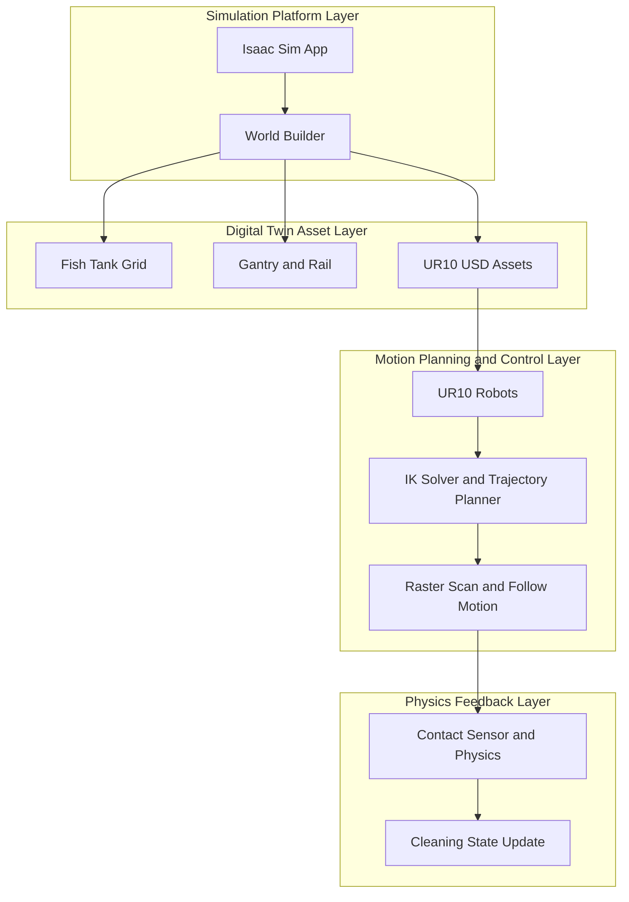

# 디지털 트윈 기반 수산양식장 청소로봇

## 프로젝트 개요
NVIDIA Isaac Sim 기반 디지털 트윈 환경에서 수산양식장(수조 격자) 청소를 시뮬레이션하는 프로젝트입니다.
UR10 로봇(단일/다중)과 갠트리 구조를 구성하고, IK 기반 스캔/추적 동작으로 오염물 청소 시나리오를 검증합니다.

## 핵심 기능
- 수조(Grid) + 레일/캐리지/로봇 디지털 트윈 월드 생성
- UR10 엔드이펙터 경로 생성 및 역기구학(IK) 제어
- 타겟 추적(follow) + raster scan 기반 청소 궤적
- 충돌/접촉 센서 기반 상호작용 시뮬레이션
- 단일/2로봇/4로봇 버전 스크립트 분리

## 디렉터리 구조
```text
디지털 트윈 기반 수산양식장 청소로봇/
|- 코드/
|  |- ik_integrate_3_2.py              # 단일 로봇 버전
|  |- ik_integrate_3_2_ro2.py          # 2대 로봇 버전
|  |- ik_integrate_3_2_ro4_final.py    # 4대 로봇 버전
|  '- ur10_mop2/                        # UR10 USD/모델 에셋
'- 발표.pdf
```

## 시스템 로직
1. Isaac Sim 앱과 월드 초기화
2. 수조/레일/재질/물체(오염물, 물) 프림 생성
3. UR10(복수 가능) 로딩 및 엔드이펙터 기준점 설정
4. IK(댐핑 최소자승 + 제한조건)로 목표 경로 추종
5. 행/열 단위 스캔 및 타겟 follow 실행
6. 접촉 상태/물리 반응을 기반으로 상태 업데이트

## 아키텍처


## 실행 환경
- NVIDIA Isaac Sim 5.x
- Python 3.10+
- `omni.isaac.core`, `pxr`, `numpy`
- GPU 환경 권장

## 실행 예시
```bash
python "코드/ik_integrate_3_2.py"
python "코드/ik_integrate_3_2_ro2.py"
python "코드/ik_integrate_3_2_ro4_final.py"
```

## 참고
- 파일별로 로봇 수(1/2/4)와 시나리오 복잡도가 다릅니다.
- 물리 파라미터/IK 파라미터는 상단 CONFIG 상수에서 조정 가능합니다.
