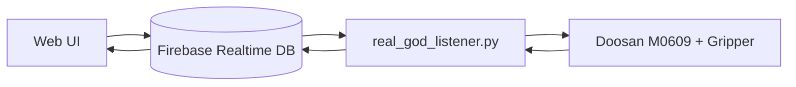

# 협동로봇 기반 핸드드립 자동화 로봇

## 프로젝트 개요
Doosan M0609 협동로봇과 Firebase 기반 UI를 연결해 핸드드립 제조를 자동화한 프로젝트입니다.
웹에서 주문/정지/복구/속도 제어를 입력하면 로봇 시퀀스가 실행되고 상태가 실시간으로 피드백됩니다.

## 핵심 기능
- 핸드드립 공정 시퀀스 자동 실행 (`real_god_listener.py`)
- Firebase Realtime DB 기반 주문/상태/제어 신호 연동
- 웹 모니터링 UI (`m0609_monitor/index.html`, `script.js`, `style.css`)
- 비상정지(STOP), 복구(RECOVER), 속도비 조정

## 디렉터리 구조
```text
협동로봇 기반 핸드드립 자동화 로봇/
|- 코드/
|  |- real_god_listener.py          # ROS2 + Doosan + Firebase 통합 제어
|  '- m0609_monitor/
|     |- index.html                 # 주문/상태 대시보드
|     |- script.js                  # Firebase 연동 로직
|     |- style.css                  # UI 스타일
|     |- write_to_firebase.py       # DB 쓰기 테스트
|     '- reat_from_firebase.py      # DB 리스너 테스트(파일명 오타 유지)
'- F2_핸드드립바리스타_...pdf
```

## 시스템 로직
1. 웹 UI가 음료/온도 주문을 Firebase `barista_control/order_command`에 기록
2. `real_god_listener.py`가 주문을 폴링/감지 후 로봇 시퀀스 실행
3. 실행 중 상태를 `barista_status/current_state`로 업데이트
4. 웹 UI가 상태를 구독해 배지/버튼 상태 갱신
5. STOP/RECOVER 명령도 동일 경로로 전달

## 아키텍처


## 실행 환경(권장)
- Ubuntu + ROS2 Humble
- Doosan ROS2 (`dsr_msgs2`, `DSR_ROBOT2`)
- Python: `firebase-admin`, `rclpy`
- Firebase 서비스 계정 키(JSON)

## 실행 순서(예시)
1. 로봇/ROS2 bringup
2. `real_god_listener.py` 실행
3. `m0609_monitor/index.html` 브라우저 실행
4. 주문 전송 및 상태 변화 확인

## 보안 주의
- 저장소 내 `serviceAccountKey.json`은 민감정보입니다.
- 운영 환경에서는 키 파일을 저장소에서 제외하고 환경변수/시크릿 매니저로 관리하세요.
